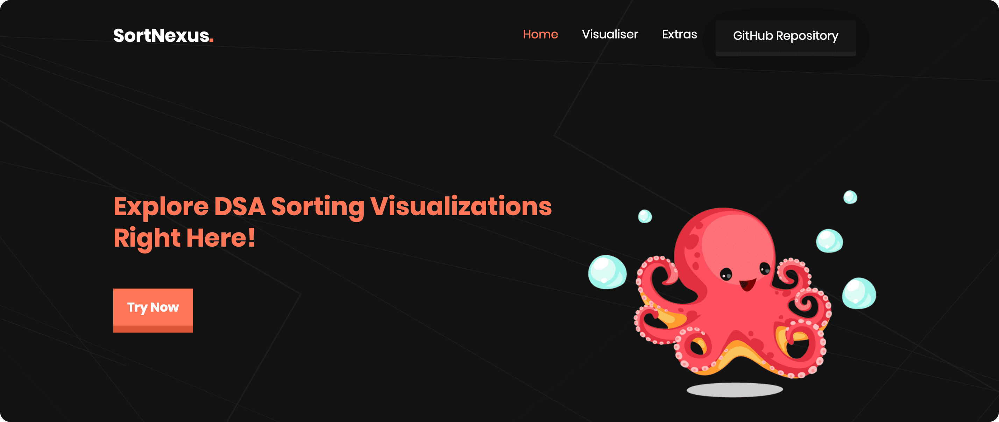
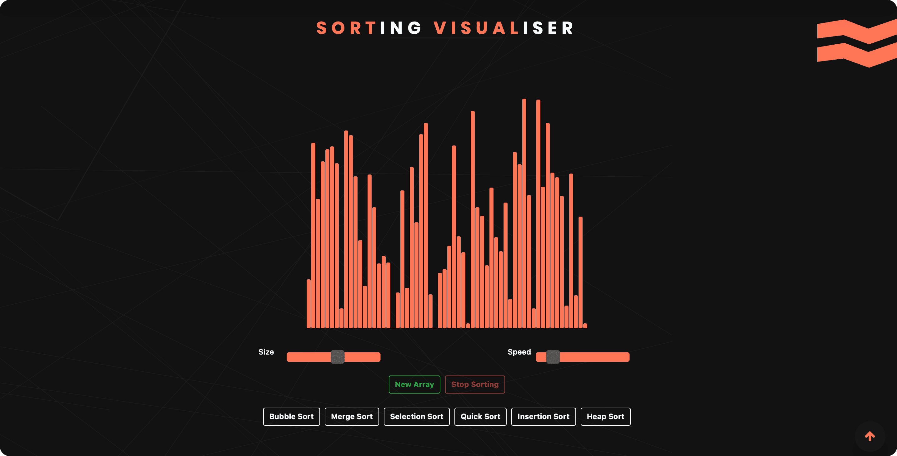
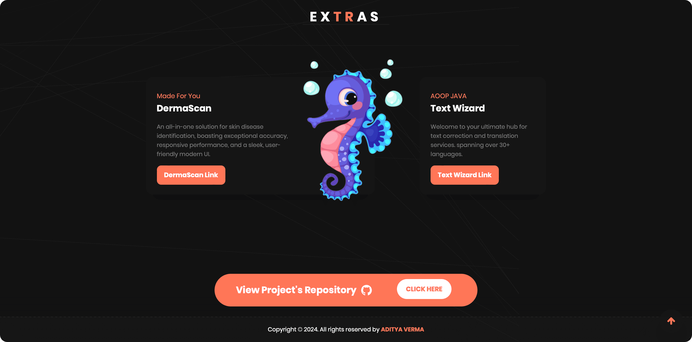
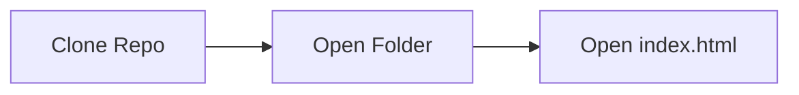

## SortNexus - DSA Sorting Visualiser

  

    
- SortNexus website is designed for visualizing data structure and algorithm sorting, offering user customization for array size and sorting speed.
- Features a responsive and high-performance UI.
- Developed using a stack of technologies including HTML, CSS, JavaScript, and Bootstrap to ensure a robust and user-friendly experience.

 ## Build Status

## Preview

 
 
 

 ## Current Tech Stack 🔻

 
  
  
  
  
  
  
  

  

 ## Installation
 

Running website on Local Host

 

 ## Current Contributors 🔻

  

