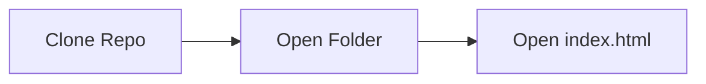

## DSA Sorting Visualiser


  <p>
    <ul>
      <li>Welcome</li>
    </ul>


 ## Build Status
[](https://app.netlify.com/sites/dsasortingv/deploys)

 ## Current Tech Stack 🔻
<div style="display: inline_block"><br>
  
  
  
  
  
  
  
</div>
  
<div><h2><strong>Developers of this repository 🔻</strong></h2></div>

<table align="center">
<tr align="center">
<td>

**ΛDIƬYΛ VΣЯMΛ**

<p align="center">

</p>
<p align="center">
<a href = "https://github.com/ADITYAVOFFICIAL"></a>
<a href = "https://www.linkedin.com/in/aditya-verma-real/">

</a>
<a href = "https://medium.com/@adityaver">

</a>
</p>
</td>

<td>
𝗦𝗮𝗵𝗶𝗹 𝗔𝗱𝗵𝗶𝗸𝗮𝗿𝗶

<p align="center">

</p>
<p align="center">
<a href = "https://github.com/Sahilopl"></a>
<a href = "https://www.linkedin.com/in/sahil-adhikari-57b445250/">

</a>
</p>
</td>
</table>

 ## Installation
 <div>
 <p>Before running the Jupyter Notebook for the model, make sure to install the dependencies listed in the 'requirements.txt' file.</p>
   
   ```
   pip install -r requirements.txt
   ```

<p>Running website on Local Host</p>




 </div>

 ## Current Contributors 🔻
<div align="center">
  <a href="https://github.com/ADITYAVOFFICIAL/Sorting_Visual/graphs/contributors">
  
</a>
</div>
